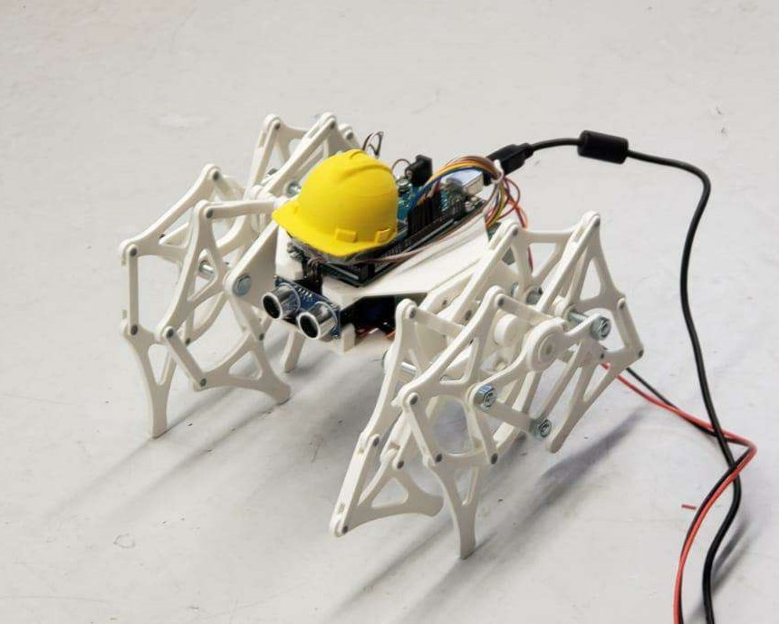
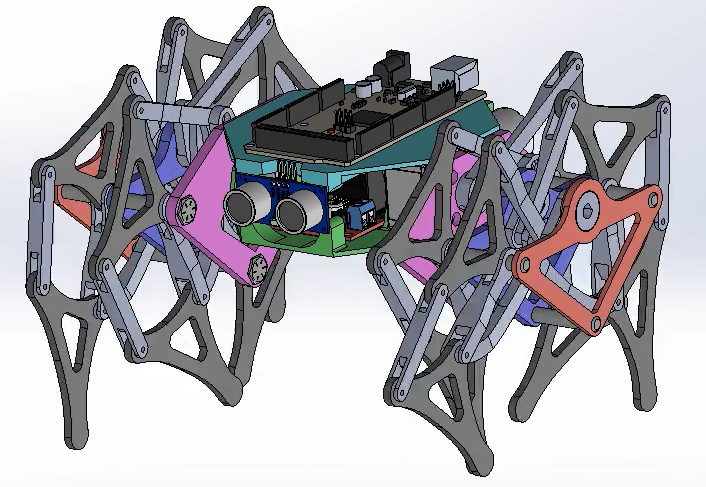
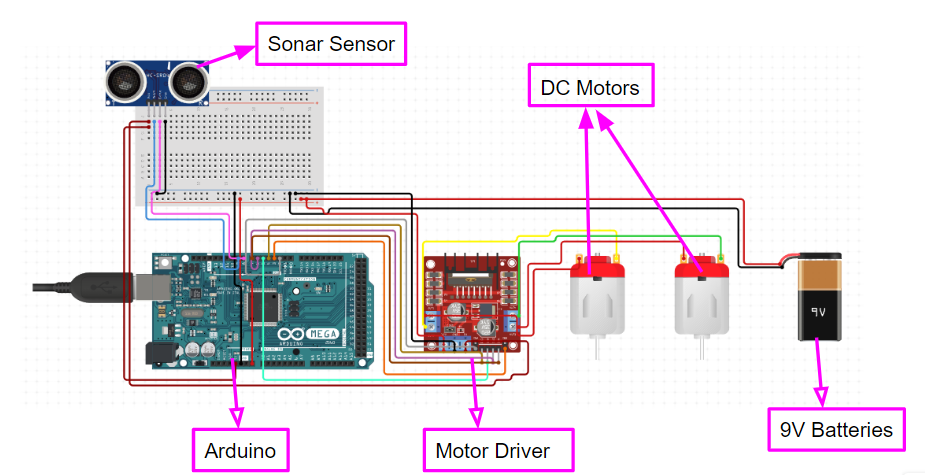

# 3D Printed Strandbeest Robot

This project involves an object-following 3D printed Strandbeest robot inspired by Theo Jansen, created as a major project for the MEEN 433 Mechatronics class at Texas A&M.



## Object Following

The Strandbeest robot is equipped with a sonar sensor, enabling it to follow objects in its vicinity. The implemented feature uses a proportional feedback controller, allowing the robot to dynamically adjust its movements based on the feedback from the sonar sensor.

P.S. The picture on the box is of our TA - we have an inside joke that "it only follows cool people."

[](assets/in_action.mp4)

### How it Works

1. The robot conducts a scan by alternating the direction of each motor to sweep itself side to side.
2. The sonar sensor detects the distance to nearby objects.
3. The sensor data is passed through a proportional feedback controller to calculate the speed for each motor.
4. The DC motors are adjusted accordingly to enable the robot to follow the detected object.

## Required Materials

Materials and components used are listed and linked below.

1. [Arduino Mega 2560](https://www.amazon.com/dp/B0046AMGW0/)
2. [Ultrasonic Module Distance Sensor](https://www.amazon.com/dp/B07B94C7KT/)
3. [12V 11RPM DC motors x 2](https://www.amazon.com/dp/B07MYVS56N/)
4. [L298N DC motor driver](https://www.amazon.com/dp/B07BK1QL5T/)
5. [3D printing filament x 1 kg](https://www.amazon.com/dp/B089S1HB8K/)
6. [Jumper Wires](https://www.amazon.com/dp/B01EV70C78)
7. [Metric Nuts and Bolts](https://www.amazon.com/Assortment-M2-M3-M4-M5/dp/B0CBMMPPKF)
8. [9V Battery x 2](https://www.amazon.com/dp/B0BJDCBHDK/)
9. [9V Battery Clip](https://www.amazon.com/dp/B081ZRBDVW/)

## Getting Started

1. Clone this repository:

    ```bash
    git clone https://github.com/daviddoo02/strandbeest_robot.git
    ```

2. Modify the CAD files using Solidworks or use the provided STL files in the `STLs` folder to 3D print your own robot.

3. Purchase the required electronics and materials as listed

4. Print and assemble the strandbeest robot

5. Flash the code onto the Arduino using the code included in the `arduino_code` folder.

6. Power the strandbeest and watch it go!

Feel free to experiment with different scenarios and objects for an interactive experience with your robot.


## Assembly Instructions

Assembly instructions are not currently available. However, if there is a significant demand or requests from users, I will consider creating detailed assembly instructions to guide you through the process.

If you have a specific request for assembly instructions, please feel free to open an issue or reach out through the project's communication channels. Your feedback is valuable, and I'll do my best to support your needs.



The schematic is as followed:



## License

This project is licensed under the MIT License - see the [LICENSE](LICENSE) file for details.

## Acknowledgments

- Inspired by Theo Jansen's Strandbeest.
- Solidworks was used for the physical design of the robot.
- Construction Helmet STL link [here](https://www.printables.com/model/109726-toddlers-construction-helmet-with-harness/)
